# 關於瑪俐的長毛巨魔ex
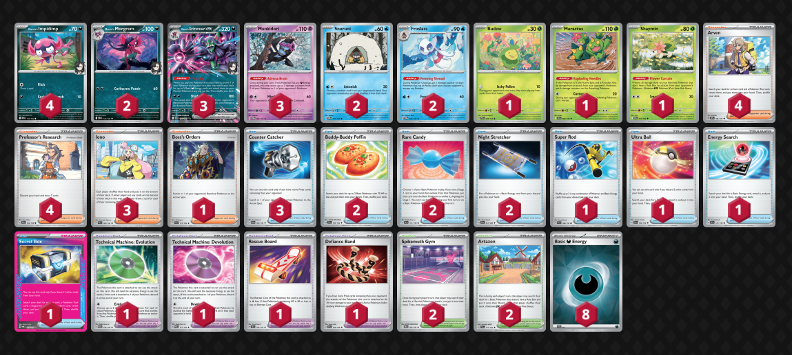

這個是我最一開始參考的構築，這個構築經過測試其實已經設計得非常完整，推薦大家直接拿這套來玩或者進行微調整。  
優點:    
- 穩定成長，特性牌庫填能非常優秀。
- 理想狀況支援者續航力與壓縮牌庫的能力很強。
- 干擾能力優秀，也可視情況打控制取勝。
- 具備衰退使得其戰術更全面。  

缺點:
- 需要落後來取得優勢非常被動。
- 過度依賴願增猿來補足傷害，這在上位的對局中容易被阻止。
- 當需要使用沙鈴仙人掌來做控制取勝時，要對環境的理解非常全面。(也包含傷害計算的熟練度)
- 遊戲時間偏長。  

構築中，不難發現真正的主角其實是雪妖女以及願增猿，巨魔是個體質非常好的主傷害打手。 類似的牌型早期其實是把巨魔的位置換成赫普的蒼響ex以及其他赫普的寶可夢。  因此，只需要把巨魔想成是體質更優秀，攻擊力更穩定的赫普的蒼響ex即可。  

在還未開發的早期，還可以透過大家對於此牌型不熟悉取得極大優勢，利用對手的操作失誤來順利取勝。 但到了台灣大師球聯賽這個時間點，巨魔的成績已經備受大家注目，會有不少人準備對策，因此在操作上，你需要逼迫對方去做出他不願意的選擇。  
例如:  
- 擊殺含羞包取得領先已讓自己後續得以繼續展開。
- 在不能擊倒巨魔的情況下，只能無奈在巨魔身上留下大量傷害。
- 牌型有換位跟頂尖槍，在開局不久就引誘對方交出來。

### 基本型的操作開局目標:
- 搶後攻。
- 展開2到3隻小妖，1隻含羞苞，1隻雪童子。
- 爭取演進優先，若是沒有這個條件則是鎖物品干擾。
- 演進視情況要嘗試先把雪妖女做出來較有優勢
- 猛擂鼓的對局可以的話可以嘗試做兩隻雪妖女，可加速遊戲的進行。(防止狙擊，還是要以謝米優先)

### 中期目標:
- 目標做出兩隻有填能願增猿。
- 落後進入對手3獎區輪次並且開始用奇樹做干擾。
- 對手3獎區這個輪次目標取得至少2到3獎
- 對手手牌資源差與我方至少有3張以上的差距

### 後期目標:  
基本上，你的中期目標對手3獎區有順利達成，那麼，你至少還有兩個輪次可以完成以下事項。
- 對方沒有當機則繼續奇樹干擾，這裡在干擾前可以選擇是否使用反擊槍+沙鈴仙人掌抓罰站的策略。
- 仔細計算巨魔搭配願增猿轉傷和雪妖女可以得到的傷害是否能擊倒對方主攻擊手。
- 仔細計算使用衰退是否能贏下遊戲或者讓對方無法再度進行攻擊行為。
- 使用任何資源或進入領先以前，注意自己老大的指令以及反擊槍的資源是否需要使用來達成結束遊戲的目標。
- 一次取完3到4獎。

### 傷害線：
||巨魔|雪妖女1|雪妖女2|願增猿1|願增猿2|願增猿3|不服輸|範圍|
|:-:|:-:|:-:|:-:|:-:|:-:|:-:|:-:|:-:|
|戰鬥場|180|10|10|10~30|10~30|10~30|30|180~320|
|後場|30|10|10|10~30|10~30|10~30|0|30~140|

### 檢索重點：
1. 可以做幾隻巨魔與雪妖女（演進目標確認）
2. 秘密箱是否卡獎
3. 老大與反擊槍的數量
4. 糖果數量
5. 能量數

以上操作給想入門巨魔的人一個基礎指南，操作沒有絕對的答案，但會有共同的目標，請想辦法完成目標，過程則是自由的。  
想針對巨魔的人，也可以反推上述的目標，給予巨魔使用者一定程度的難題。

# 2025-06-07 ~ 08 台灣大師球賽前預測

關於這次比賽，其實真的蠻好預測今年台灣環境會遇到的牌型，從32強的牌型分布公開後，重點牌型都有命中。

1. 猛擂鼓ex  
2. 多龍ex  
3. 多龍噴ex
3. 電電蟲 Box  
4. 沙奈朵ex  
5. 巨魔 ex

以上順序由多到少往下排序，基本上都有預測到。  
綜合考量後，巨魔在與前四名的對局中，除了魔靈多龍這個型會是比較難打的對局，考量到賽場應該會有不少張濕氣可達鴨應該會在多龍魔靈的對局上取得優勢，因此決定去對賭魔靈多龍的數量會很少，相對會出現的應該是純多龍或著多龍噴。如果是這樣的牌型，那巨魔勝率應該會相對高了一些。  
事實上，這次對局到的多龍都是魔靈自爆的類型，雖然最後都是險勝，但超後悔沒投入濕氣可達鴨。

## 沒有預測到但後來評估覺得很強的牌型:  
- 皮皮ex Box
- 賽富豪多龍ex
- 炸彈鋁鋼橋龍ex

那麼，為何明明認為巨魔是版本最佳解，卻在預測把巨魔擺在環境最後一名呢?  
巨魔絕對是這個版本的答案，但是他在瑞士輪25分鐘 BO1 的賽制有著致命的弱點，就是 **「容易雙敗」** 以及沒有針對石碰的有效策略，所以遇到石碰控制也會極為不利。

巨魔需要有以下的認知，才能快速取勝:
- 領先與落後輪次的掌握 (通常要儘可能落後)
- 雪妖女特性傷害要算得準與快
- 清楚各種對局的布局目標
- 引誘對方交出老大的指令，換位以及頂尖槍等強力資源

# 大師球比賽構築過程

 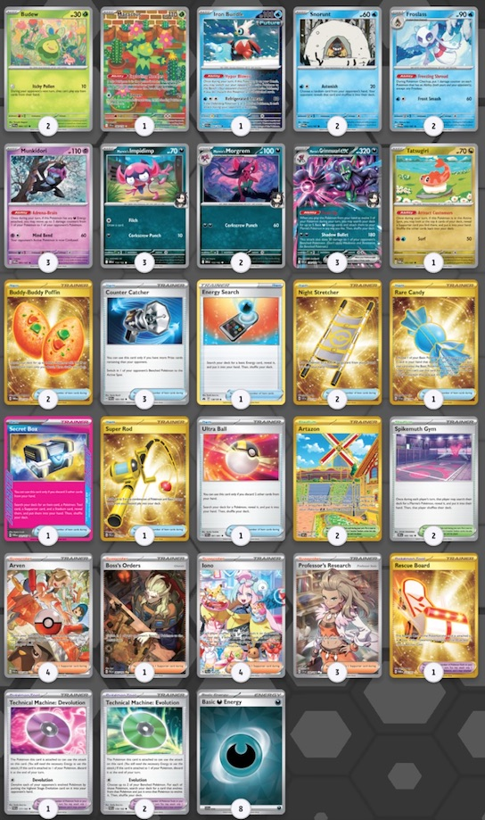  

   這套牌組是今年賽季最後台中高級球我所採用的配置，其實多少有點自己的想法和實驗性質在裡面。 

  * 採用一顆糖果與兩個演進的配置，強調要儘可能進行演進來爭取培養巨魔與雪妖女。
  * 採用米立龍嘗試解決支援者續航力可能會斷檔的問題。
  * 投入鐵包袱來進行有效的 寶寶 寶可夢狙擊/替換主要寶可夢上來擊殺。
  
  台中高級球的體悟是，面對快攻牌型(蒼響與猛擂鼓)，你沒有後場防禦能力是絕對不行的。  
  而且有正式經歷過一場雙敗和兩場差點雙敗的局面，以及在面對快攻的牌型，我們需要更快速養成巨魔的方式來給予對手壓力，在本次經驗後我與同行的隊友進行檢討與討論:  
  
  ### 初步的結論是:  
  - 糖果要2 演進改1 應該是較好的配置。
  - 然後要把謝米投入回來，逼迫對手從戰鬥場開始取獎。
  - 加速遊戲進程，減少整體對局時間。 

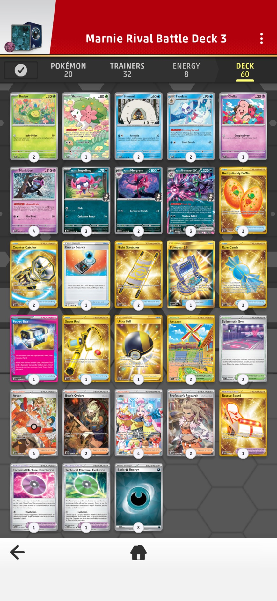

  最後決定出戰大師球聯賽的配置，這個配置相較於基礎型其實有些許不足的地方，但這是為了避免在瑞士輪的賽制中雙敗而得出的答案： 

  * 投入4張願增猿，除了增加不需要依賴場地深鉢鎮也能透過支援者翻出來的機率以外，在內戰以及其他牌型依賴願增猿轉傷的牌型，願增猿越多，優勢就越大。
  * 採用標準2老大指令與2反擊捕捉器的配置，這種配置會增加對局上的主動性，可以在對局中不用過度依賴反擊槍需要落後時才能精準打擊的需求。
  * 投入皮寶寶，來處理開局展開有問題即將被鎖道具的補資源手段，有時候比起鎖道具妨礙對手，先讓自己有足夠的資源做展開反而更有優勢。
  * 投入 3.0 在一些程度上可以緩解支援者斷檔的問題，同時，也可以增加支援者多元選擇的機會。
  
  這個配置需要先強調他的缺點，就是我放棄了透過沙鈴仙人掌控制來取勝的路線。  
  這是個很重要的戰術，基本上控制的戰術只要能逼對手繳出所有的換位資源，最後一定會贏！！ 是個很難讓人放棄的手段，但是這個必勝的路線卻是造成雙敗的重要主因，它會延長遊戲的時間，會讓不可控制的因素變多。（你的對手不是你可以控制的）
  ```
  「你無法選擇你的對手，也無法控制他們的行為，但你完全可以掌控你自己的行為。」  
  ```
  在瑞士制那樣的短時間賽局中，我選擇讓自己沒有抓罰站的選擇，就會改變輪次的計畫，這會讓遊戲的進展快一些。  
  主要影響的對局應該是猛擂鼓的勝率會降低，基本上猛擂鼓繳出頂尖槍後，被抓罰站沒有換位或者弗圖博士的配置真的只能認輸。  
  但即便如此，只要能順利在3獎區做干擾，我還是評估巨魔打猛擂鼓是相對較有利的。

# 單卡解析

以下我針對常見的單卡跟大家說明我的見解。

## 不公印章 VS 秘密箱：   
<div style="display: flex; padding:10">
  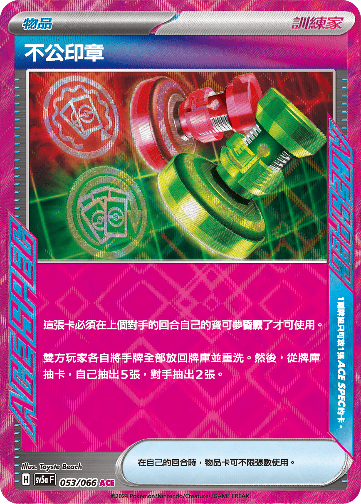
  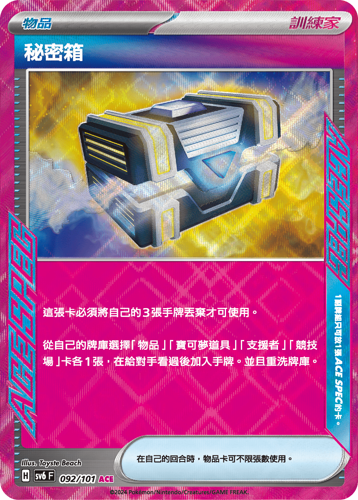
</div>

巨魔牌型的ACE位 基本上有這兩種選擇，由於巨魔有二階寶可夢以及沒有指定檢索的工具寶可夢，這使得這個牌組天生會有支援者斷檔的問題，因此在開發後期，大部分玩家都選擇了有強力支援者續航力，同時又能以四張換四張壓縮牌組的秘密箱為主要的ACE SPEC。 

相較於印章如果沒有先有效壓縮過牌庫，抽起來五張非常有可能動點全失的機率其實是相當高的。  
秘密箱同時能快速幫助巨魔成長，提高對局中完成 Turn 2 Kill 的機率，以及後期協助湊齊贏下遊戲的所有資源，非常強力的道具。   
強力推薦採用秘密箱。

## 能量輸送 VS 大地之容器：

<div style="display: flex; padding:10">
  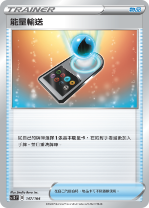
  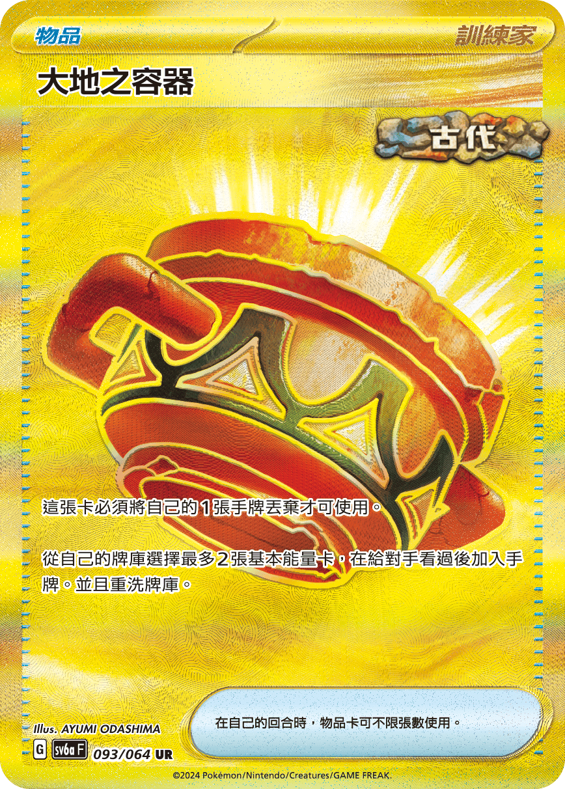
</div>
  
  
  這兩個物品都是協助將能量從牌組撈取出來，用來協助願增猿填能或著進行開局演進的重要角色。 差別在於一張使用後拿取一張基本能量另一張則是需要額外扔一張手牌資源撈取牌組中兩個基本能量。基本上兩張的選擇都有其優點。  
  以下我來解釋我自己的看法， 我個人較推薦在巨魔的牌組中投入能量輸送，原因如下：  
  - 巨魔的資源在初期其實沒有什麼可以扔掉的空間，因此使用大地容器時如果陷入選擇困難會加長遊戲時程。  
  - 從牌庫中多拿一張能量看似有壓縮牌庫的優勢，但其實巨魔牌組能量標準配置8張，非常剛好，巨魔的特性從牌庫填能，我們應該儘可能保留一些能量再牌庫中。
  
  且經驗告訴我們撈出來的能量下一回合不是透過博士研究進棄牌區就是被對手奇樹洗回牌底，在這樣的情況下，若是後續翻到願增猿我會希望牌庫中有足夠的能量讓我也能繼續翻到，因此多撈一張能量出來不見得是巨魔這個牌型適合的動作。  
  如果你很在乎後期要能更極限的壓縮牌組，那麼大地之容器可能會是你不錯的選擇。
  

## 沙鈴仙人掌： 
<div style="display: flex; padding:10">
 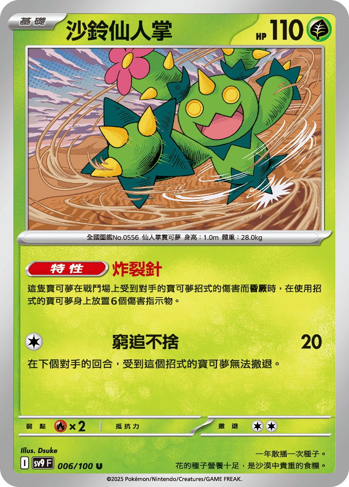
</div>

  這隻寶可夢打20草系的傷害同時會讓對方無法撤退，身上的特性還能造成對手寶可夢身上再多60點傷害，這個 總共80點的傷害你只需要有兩隻願增猿你就能氣絕血量320 的多龍ex (80+180+30+30=320)，可以說多龍的對局扮演著蠻重要的角色，但是上位的對局肯定會避開啟動仙人掌的特性，所以雖然很強，但是被動的缺點仍然非常明顯。 再來抓罰站這個惡劣的招式，會讓換位資源很稀缺的牌組非常頭痛。基本上只要能逼出對方所有的換位手段，出仙人掌開始罰站跟願增猿慢慢轉傷害，勝率幾乎是99%。

## 謝米：  
<div style="display: flex; padding:10">
 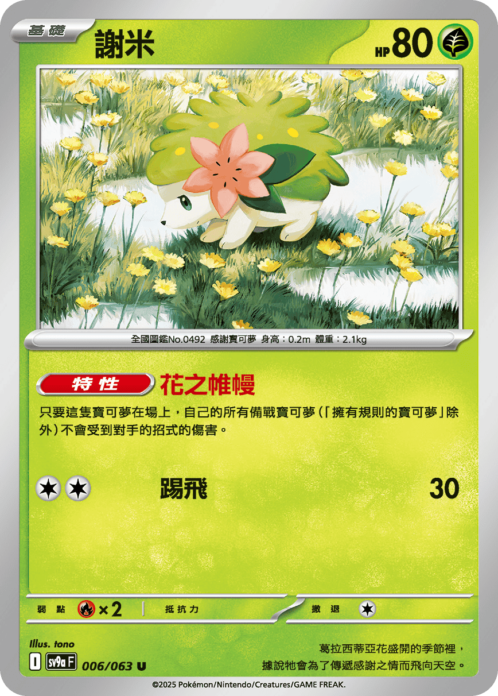
</div>

  這隻寶可夢在面對有穿傷狙擊的牌型非常重要，沙奈朵以及猛擂鼓的對局都會需要儘可能早點將謝米撈出來進行後場的防禦，尤其猛擂鼓速度非常快，需要考慮優先展開後場防禦。  
  一但選擇防禦後，後場位至少一格願增猿的配置也會受限，這裡需要注意。

## 溼氣可達鴨：
<div style="display: flex; padding:10">
 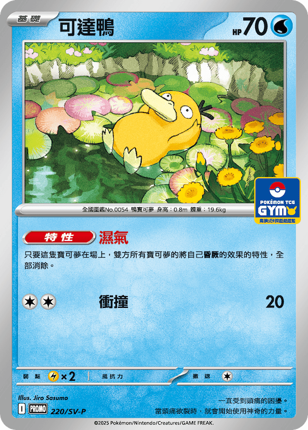
</div>  

  我認為在環境中，如果魔靈的牌型非常多，應該要投入濕氣可達鴨來阻止對方自爆取得優勢，巨魔這個牌型因為需要成長偏慢，沒有搶到後攻會非常難以應付魔靈多龍，勝率真的非常低，建議要抽一個空間投入。

## 鐵包袱：  
<div style="display: flex; padding:10">
 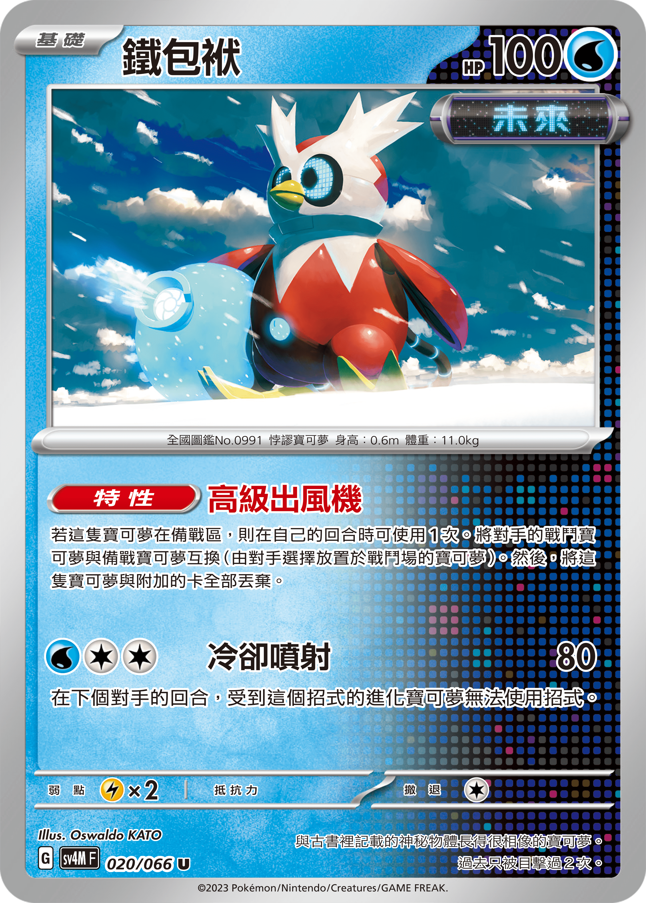
</div>

鐵包袱也是非常好用的工具寵物，除了可以協助避開再戰鬥場及寶寶系列寶可夢，同時可能可以有效狙擊對方的主要寶可夢。  
遊戲終局要搶獎勵時，有非常大的奇效。 如果牌組微調時還有空間，強烈推薦可以投入，部份對局效益非常的高。

## 能量轉移：  
<div style="display: flex; padding:10">
 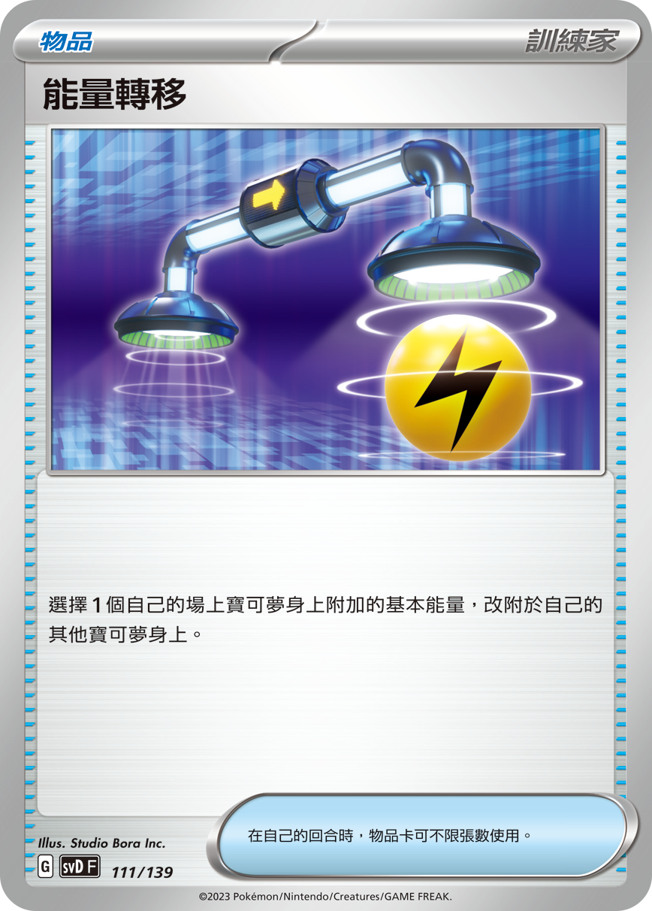
</div>

  能量轉移的基本用途，使用在巨魔特性發動時，玩家可以考慮多拿兩顆出來，壓縮牌庫的同時可以使用能量轉移不使用手填動作就完成一隻願增猿，非常強力。  
  缺點是其屬於中後期才能發揮作用的卡，依據需求選擇是否投入。
  
## 招式學習器 衰退：  
<div style="display: flex; padding:10">
 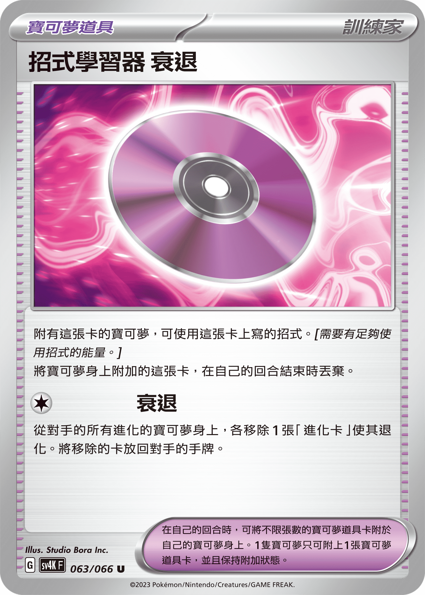
</div>

  會用到此卡片的對局通常是血量偏高的進化型寶可夢對局，以下列出有機會用到贏下比賽的牌型：  
    1. Ｎ的索羅亞克ex  
    2. 火箭隊的超夢ex  
    3. 沙奈朵ex  
    4. 噴火龍ex  
    5. 多龍ex  
    6. 祭典  
    7. 陸地水母ex    
  確認好傷害，以將對手的主要打手衰退並且確認對方無法短期內再度建立打手為目標去使用。

# 對局計畫
其實我每個對局根據情況不同有多種計畫，以下我只提供最理想的狀況供大家參考。

## 猛擂鼓ex  
猛擂鼓的對局拿獎計畫為 3-3 或著 2-4。  
由於目前猛擂鼓都是採用貓頭夜鷹＋草碰ex 的軸進行運作，其運作原理都是先攻時使用怒鶯哥ex，旋轉洛托姆，大地容器，百變怪，草碰ex特性填能＋抽牌來大量壓縮牌庫＋棄牌區堆能量給奧林博士使用。  
這樣的運作性質給了原本就弱草的巨魔非常多的漏洞可以取勝。   
因此有些玩家主張猛擂鼓是好打巨魔的牌型，我持保留態度，猛擂鼓無論怎麼操作，只要構築概念不變，巨魔只要能順利展開都應該是猛擂鼓ex的惡夢，因此我會認為是55開或者64。  
假設對方順利開局，場上應該會至少有一張草碰ex 以及兩張咕咕，一張旋轉路洛托姆，以及小猛擂鼓／大猛擂鼓。  
首先，巨魔這裡要做好心理建設，我們勢必會從讓對方兩獎～三獎後才開始遊戲，猛擂鼓能夠干擾你的手段非常的少，且幾乎不會前期使用，因此要專心做展開，目標是場上至少要存活一張雪妖女，兩組巨魔，至少一組有能量的願增猿。  
因此理想的開局希望能夠有2小妖1雪童子1謝米，戰鬥區使用含羞苞做干擾或者皮寶寶補牌都行。  
極度推薦可以的話就先演進出雪妖女，開始對草碰跟洛托姆鋪傷。  
我們的計畫是逼對方交出頂尖槍跟貓頭夜鷹後對手三獎區做奇樹干擾的那個輪次擊殺草碰ex＋ 洛托姆/貓頭夜鷹拿取三獎。（這個輪次一定要有養下一隻巨魔的準備）  
進入 3-3 輪次後，這時候期望對方無任何動點，三個選擇：
  - 繼續使用巨魔抓取草碰ex／吉雉雞ex 到戰鬥場 擊倒兩張(洛托姆或貓頭夜鷹或咕咕)取得三獎。
  - 使用沙鈴仙人掌抓取夢幻ex／吉雉雞ex 等無威脅性工具寶可夢作為罰站的對象，慢慢地轉移傷害取完剩下三獎。
  - 使用巨魔抓取 吉雉雞ex 繼續鋪傷，賭對方當機動不起來，最好還是繼續準備養好下一隻巨魔，以防意外發生，這個選擇可以在需要拿四獎時採用。

## 多龍ex  
  由於魔靈多龍勝率真的偏低，因此我們的假想敵以純多龍為主。  
  拿獎策略為 1-3-2，純多龍的對局概念與巨魔內戰非常像，比拼的是誰先打第一拳在大隻的身上。   
  並在過程中透過猴子轉傷與雪妖女跳傷害擊倒多龍奇破壞動點為主要目標。  
  首先我們期待能搶到後攻，優先進行鎖道具干擾的動作，開局的展開目標為，3小妖 1雪童子。做得到的話，優先演進雪妖女並開始展開願增猿。

  上位的對局高機率會不急著拿獎，建立出3~4張偵查指令的多龍奇將 能量，多龍ex 以及 老大的指令 都湊齊後，才會開始重點的進攻，並且會保留你場上的寶寶 寶可夢，留到最後再處理。  
  但是這些在被鎖道具的狀況下都需要時間，我們也要盡可能使用博士研究撈取資源來壓縮牌庫。 在含羞苞互噴花粉的對局中，搶先做出猴子取得領先是比較優的狀況。輪次進入 5-6。  
  這很有可能會逼迫對手將多龍ex做出來後，會先打70 在戰鬥場的花苞身上，輪次進入5-5。
  這時我們將巨魔做出來，打第一拳180在對方多龍身上，並搭配雪妖女往對方偵查指令的多龍奇開始鋪傷害。（這裡可以的話請多做一隻猴子）  
  理論上如果對方能量夠，會選擇做猴子轉傷30 到我方的猴子身上，搭配200+60 鋪傷，我的猴子極高機率會被處理掉（20+60+30=110）同時選擇一隻多龍奇進化ex 進入 5-4。  
  這個回合，理論上因為上一回合對方選擇做猴子，很有可能多龍能量斷檔，然後多龍奇身上已經有20點傷害，這樣就會特別有利。  
  我們這回合的目標就是猴子轉傷給多龍奇（20+30+30+10=90) + 擊倒多龍(180+150)拿三獎，同時將第二隻巨魔做出來後，四獎區奇樹干擾。 輪次會進入 2-4，此時場上狀況是一張多龍奇+ 沒有能量的多龍ex+猴子。（可能會有吉雉雞ex）
  這時即便他使用赤松或著沖天能量或著結晶讓多龍ex可以作出攻擊擊倒巨魔，輪次變成2-2後。
  由於我們仍然有猴子可以轉傷以及巨魔可以扛接下來的傷害，接下來有以下勝利路線：
    - 鋪傷後使用衰退拿最後兩獎
    - 翻出老大指令擊倒吉雉雞ex 
    - 透過轉傷拖延對手拿獎打兩拳擊倒多龍得勝

## 電電蟲 Box   
拿獎策略為 2-2-2 ，老實說這個對局會是右手的比拼。  
首先理想是搶到後攻，這樣勝率會比較高，對局的計畫會從讓兩獎開始。  
展開會需要 2到3小妖+1雪童子，做得到的話使用演進，做不到則花粉干擾嘗試阻止他展開速度變慢。   
大部分對局理想會採用鐵臂膀＋護符做感激放大為主，如果對方運氣很好可以開局開到赤松，那能量優勢會非常巨大。   
我們要做的事情是把他的鐵斑葉ex 逼出來，然後處理掉，讓對方的能量優勢順間崩潰。
因此我們會在一開始先被感激放大後，進入 6-4。

這時候奇樹意義不大，我們要做得事情是把兩隻巨魔+雪妖女養出來，儘可能壓縮牌庫並儘可能開始作出猴子，打出第一拳 180到210 + 後場 30 的傷害。（如果後場有電電蟲沒有護符請直接處理掉）
這時候對方應該有兩種輪次選擇：
  - 使用老大指令 抓小隻繼續感激放大 進入 6-2。
  - 開始撈出鐵斑葉ex 把能量配置好後擊倒巨魔 進入 6-2。

  選擇老大指令就表示沒有赤松累積能量，他會面臨後續被奇樹後+能量不足的問題。 因此不太可能選這條路。（頂尖捕捉器則有可能）  
  撈出鐵斑葉ex 如果不是依賴派帕拿高級球 則還有機會使用赤松繼續累積能量，是比較合理的選擇。  
  因此為了對付上面的輪次，打出第一拳那個回合最好要能做出雪妖女備著以及做好一隻猴子，這樣才能在6-2 干擾後順利地處理掉鐵班葉ex。(180 +10(雪妖女，對方結束) +10(雪妖女，我方結束) +20（猴子轉傷）)
  即使沒有猴子轉傷，由於鐵班葉ex 攻擊會手酸一回合，只要兩獎區奇樹有成功讓對方當機，那麼破壞能量優勢只是延後到下一回合對方結束而已。  
  進入2-2 後 理論上對方除了失去手牌資源優勢，且場上的能量也蕩然無存，將密勒頓擊倒後即可結束遊戲。

## 噴火龍ex  
  拿獎策略 1-3-2，這個對局真的46開，偏不利。  
  噴火龍的對局通常都伴隨著魔靈，但比起多龍還有鋪傷的能力，噴火龍就比較不會這麼趨於劣勢，計畫中會需要做衰退，遊戲時間會拉長。  
  首先如果翻開看到是噴火龍的對局，我們要毫不猶豫地直接選擇花粉干擾。  這會極大機率為我們爭取不少展開的時間，展開需要3小妖，1雪童子，1猴子。  
  你會需要對方先養出噴火龍ex後，養出雪妖女，你打出第一拳180 在對方的噴火龍ex身上，鋪傷30 在小火龍或火恐龍身上，這時候的輪次應該是6-5(戰鬥場花苞被噴火龍擊倒)
  再來會發生的事情可能是 魔靈炸130 + 210 擊倒巨魔，這時輪次 5-3。  
  養出第二隻巨魔（第三隻準備），目標為 反擊槍抓大比鳥ex+奇樹干擾後，猴子填能，鋪傷180在大比鳥身上，繼續鋪傷30 給小火龍或火恐龍 輪次5-3。  
  再來會發生的事情比較理想的是噴火龍會決定使用老大指令抓雪妖女或猴子進入5-2，並再下一回合配合魔靈自爆拿下最後兩獎。  
  因此這裡無論如何都要做出將大比鳥ex+噴火龍ex+火恐龍成功衰退的輪次，配合兩獎區奇樹干擾對方，我方正式衰退反擊進入 2-2 輪次，且對方只剩三張手牌，場上沒有任何攻擊資源，應該就能順利拿完兩獎結束遊戲。

## 巨魔內戰  
  拿獎策略為 2-1-3 ，內戰的對局其實理論上滿快就能分出勝負的，比拼的是打第一拳180＋誰猴子做得多，最好要能搶到後攻。  
  展開會需要 2到3 小妖＋ 1猴子，這個對局不需要做雪妖女，需要的是每回合能穩定做出有能量的猴子。  
  可以落後兩獎沒有問題，但是第一拳一定要是我方先打在對方的巨魔ex上，以下我們以對手開局翻到老大的優勢局做例子 :   

  計畫會是引誘對方先攻擊我方的花苞進入領先，過程中請務必先建立起一隻有能量的猴子，這裡我假設他翻到老大指令一次處理掉一隻小妖＋花苞 ，進入輪次6-4。  
  接下來我們養出巨魔並嘗試四獎區奇樹干擾，先打180 在對方巨魔身上，鋪傷30給猴子，這裡目標要有2隻猴子有能量。
  這裡對方即使做出了兩隻猴子也無法將我方猴子擊倒，比較有可能的策略是，如果我後場有一隻小妖，會選擇打180後場鋪傷擊倒小妖，輪次進入 6-3。  
  這個輪次發生務必要把小妖從棄牌區撈回場上（擔架或著釣竿＋場地寶芬），做出第3隻猴子，我們需要將巨魔身上的傷害90點給對方的巨魔，開三獎區奇樹後，擊倒巨魔，我方巨魔血量剩230，對方場上有約30點的傷害。輪次進入4-3。

  這個輪次我們會期待對方能夠再做出巨魔，但做不出第三隻猴子。應該會選擇至少轉傷30給我方巨魔，這回合理論上會打一拳180無法擊倒巨魔 後鋪傷30。輪次維持4-3。

  這裡我們三隻猴子有足夠傷害就可以開始反擊，30+30+30+30=120 可以擊倒後場的猴子或著小妖，同時養出新的巨魔在後場準備好,
  在對方的巨魔身上打下180，輪次進入3-3 。

  這個輪次場上狀況為 我方戰鬥場巨魔有100血，對方巨魔還有140血且場上只有一隻猴子，且輪次無法讓對方捕捉後場(未領先)，這裡對方選擇直接擊倒巨魔。輪次會來到3-1，場上有30傷害。  

  做到這個輪次，再兩回合就能分出勝負，首先我們要做一獎區奇樹，後續對方要能繼續作猴子的可能性非常非常低。也無法開反擊槍抓最後一獎，只要對方動不起來也無法抓後排領最後一獎，基本上在這麼難的內戰對局中，最後我們還是能一次拿完三獎。

  以上這個局由於我方成功做出三隻猴子加上手牌干擾，理論上這個對局對手巨魔除非右手撈出鐵包袱否則應該沒有贏的可能，巨魔的內戰只要沒有人失誤，那就真的是看牌順的對局，因此輸了也不用太在意就是了。

# 結語

巨魔這種要使用雪妖女在雙方的檢查階段中跳傷害的牌型對我來說也非常新鮮，因為部分牌型的對局經驗偏少，有些傷害線我也是到了大賽現場學習的，結論就是這副牌真的需要大量的練習與宏觀的傷害線觀察能力，只要練習量足夠，並且不失誤，我認為巨魔應是台灣環境中奪冠的超級黑馬。

這裡真的是很感謝願意在大賽場合與我檢討的對手們，你們讓我感覺到這個遊戲大部分的玩家還是很友善的，這樣其實比較有動力繼續玩下去。

大賽檢討過後，這套牌還能調整的方向如下：  
- 魔靈系列算是非常不利的對局，強烈建議可以投入濕氣可達鴨來獲得一些輪次的緩衝空間。
- 不服輸頭戴可以在部分對局要搶獎勵時有極大的效益（例如本次BO3 時間到是比獎勵領先，或者猛擂鼓的對局）
- 沙鈴仙人掌可以在後續有氣球的環境中加入構築，會讓整套牌的戰術更完善。

以上就是這次台灣大師球聯賽 大師組 8強 瑪俐的長毛巨魔ex的構築歷程與理念說明，這麼長又複雜的文，看到這裡各位真的辛苦了。  

朋友們與隊友稱我是台灣最強巨魔，但我心裏明白自己在這次比賽中運氣的比例佔了多少份量，因此我感恩每一位與我有緣的對手，我虛心接受各位的指教。

我是來自古月鳥戰隊的 [駱梨](https://www.facebook.com/luo.liju/)，本篇文章的問題可以直接聯絡我，我會盡力回答。

我們團隊成員主要活動於新北板橋或土城區，本隊鼓勵大家可以發揮創意來玩這個遊戲，同時我們也很努力在研究環境與賽場，有意願交流請聯絡隊長 [邱世鈞](https://www.facebook.com/shihchun.chiu.3)。


這篇文章的最後，附上我調整過後的巨魔牌型給大家做個參考：

