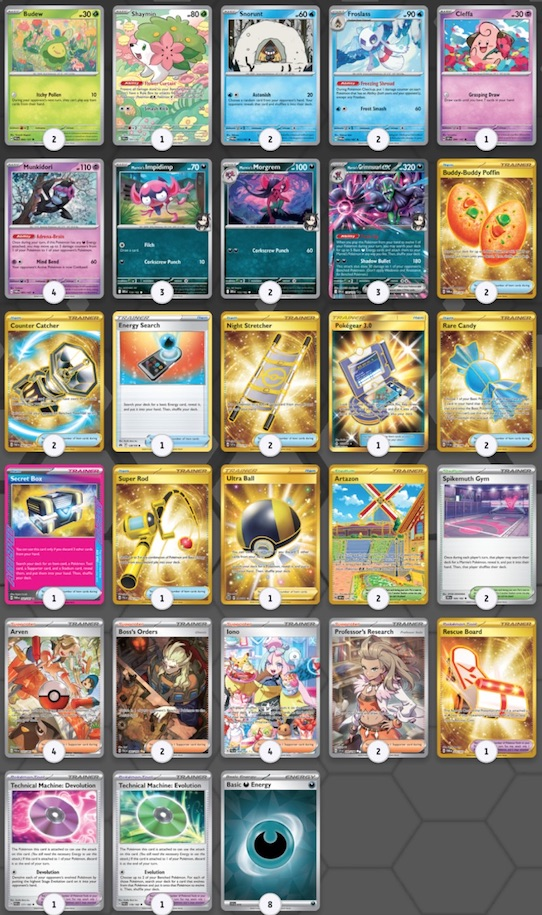

# 關於瑪俐的長毛巨魔ex

這個是我最一開始參考的構築，這個構築經過測試其實已經設計得非常完整，推薦大家直接拿這套來玩或者進行微調整。  
優點:    
- 穩定展開與穩定成長。
- 理想狀況支援者續航力與壓縮牌庫的能力很強。
- 干擾能力優秀，也可視情況打控制取勝。
- 具備衰退使得其戰術更全面。  

缺點:
- 需要落後來取得優勢非常被動。
- 過度依賴猴子來補足傷害，這在上位的對局中容易被阻止。
- 當需要使用沙鈴仙人掌來做控制取勝時，要對環境的理解非常全面。(也包含傷害計算的熟練度)
- 遊戲時間偏長。  

構築中，不難發現真正的主角其實是雪妖女以及願增猿，巨魔是個體質非常好的主傷害打手。 類似的牌型早期其實是把巨魔的位置換成赫普的蒼響ex以及其他赫普的寶可夢。  因此，只需要把巨魔想成是體質更優秀，攻擊力更穩定的赫普的蒼響ex即可。  

在還未開發的早期，還可以透過大家對於此牌型不熟悉取得極大優勢，利用對手的操作失誤來順利取勝。 但到了台灣大師球聯賽這個時間點，巨魔的成績已經備受大家注目，會有不少人準備對策，因此在操作上，你需要逼迫對方去做出他不願意的選擇。  
例如:  
- 擊殺含羞包取得領先已讓自己後續得以繼續展開。
- 在不能擊倒巨魔的情況下，只能無奈在巨魔身上留下大量傷害。
- 牌型有換位跟頂尖槍，在開局不久就引誘對方交出來。

### 基本型的操作開局目標:
- 搶後攻。
- 展開2~3隻小妖，1隻含羞苞，1隻雪童子。
- 爭取演進優先，若是沒有這個條件則是鎖物品干擾。
- 演進視情況要嘗試先把雪妖女做出來較有優勢
- 猛擂鼓的對局可以的話可以嘗試做兩隻雪妖女，可加速遊戲的進行。(防止狙擊，還是要以謝咪優先)

### 中期目標:
- 目標做出兩隻有填能猴子。
- 落後進入對手三獎區輪次並且開始用奇樹做干擾。
- 對手三獎區這個輪次目標取得至少二~三獎
- 對手手牌資源差與我方至少有三張以上的差距

### 後期目標:  
基本上，你的中期目標對手三獎區有順利達成，那麼，你至少還有兩個輪次可以完成以下事項。
- 對方沒有當機則繼續奇樹干擾，這裡在干擾前可以選擇是否使用反擊槍+沙鈴仙人掌抓罰站的策略。
- 仔細計算巨魔搭配猴子轉傷和雪妖女可以得到的傷害是否能擊倒對方主攻擊手。
- 仔細計算使用衰退是否能贏下遊戲或者讓對方無法再度進行攻擊行為。
- 使用任何資源或進入領先以前，注意自己老大的指令以及反擊槍的資源是否需要使用來達成結束遊戲的目標。
- 一次取完3~4獎。

### 傷害線：
||巨魔|雪妖女1|雪妖女2|猴子1|猴子2|猴子3|不服輸|範圍|
|:-:|:-:|:-:|:-:|:-:|:-:|:-:|:-:|:-:|
|戰鬥場|180|10|10|10~30|10~30|10~30|30|180~320|
|後場|30|10|10|10~30|10~30|10~30|0|30~140|

以上操作給想入門巨魔的人一個基礎指南，操作沒有絕對的答案，但會有共同的目標，請想辦法完成目標，過程則是自由的。  
想針對巨魔的人，也可以反推上述的目標，給予巨魔使用者一定程度的難題。

# 2025-06-07 ~ 08 台灣大師球賽前預測

關於這次比賽，其實真的蠻好預測今年台灣環境會遇到的牌型，從32強的牌型分布公開後，重點牌型都有命中。

1. 猛擂鼓ex  
2. 多龍ex  
3. 多龍噴ex
3. 電電蟲 Box  
4. 沙奈朵ex  
5. 巨魔 ex

以上順序由多到少往下排序，基本上都有預測到。  
綜合考量後，巨魔在與前四名的對局中，除了魔靈多龍這個型會是比較難打的對局，考量到賽場應該會有不少張濕氣可達鴨應該會在多龍魔靈的對局上取得優勢，因此決定去對賭魔靈多龍的數量會很少，相對會出現的應該是純多龍或著多龍噴。如果是這樣的牌型，那巨魔勝率應該會相對高了一些。  
事實上，這次對局到的多龍都是魔靈自爆的類型，雖然最後都是險勝，但超後悔沒投入濕氣可達鴨。

### 沒有預測到但後來評估覺得很強的牌型:  
- 皮皮ex Box
- 賽富豪多龍ex
- 炸彈鋁鋼橋龍ex

那麼，為何明明認為巨魔是版本答案，卻在預測把巨魔擺在環境最後一名呢?  
巨魔絕對是這個版本的答案，但是他在瑞士輪25分鐘的賽制有著致命的弱點，就是 **「容易雙敗」** 以及沒有針對石碰的有效策略，所以遇到石碰控制也會極為不利。

巨魔需要有以下的認知，才能快速取勝:
- 領先與落後輪次的掌握 (通常要儘可能落後)
- 雪妖女特性傷害要算得準與快
- 清楚各種對局的布局目標
- 引誘對方交出老大的指令，換位以及頂尖槍等強力資源

# 大師球比賽構築過程

<table>
  <tr>
    <td width="500" >
       
    </td>
    <td>
  

  這套牌組是今年賽季最後台中高級球我所採用的配置，其實多少有點自己的想法和實驗性質在裡面。 

  * 採用一顆糖果與兩個演進的配置，強調要儘可能進行演進來爭取培養巨魔與雪妖女。
  * 採用米立龍嘗試解決支援者續航力可能會斷檔的問題。
  * 投入鐵包袱來進行有效的 寶寶 寶可夢狙擊/替換主要寶可夢上來擊殺。
  
  台中高級球的體悟是，面對快攻牌型(蒼響與猛擂鼓)，你沒有後場防禦能力是絕對不行的。  
  而且有正式經歷過一場雙敗和兩場差點雙敗的局面，以及在面對快攻的牌型，我們需要更快速養成巨魔的方式來給予對手壓力，在本次經驗後我與同行的隊友進行檢討與討論:  
  
  ### 初步的結論是:  
  - 糖果要2 演進改1 應該是較好的配置。
  - 然後要把謝米投入回來，逼迫對手從戰鬥場開始取獎。
  - 加速遊戲進程，減少整體對局時間。 
  

    </td>
  </tr>
  <tr>
    <td>
      
    </td>
    <td>
  

  最後決定出戰大師球聯賽的配置，這個配置相較於基礎型其實有些許不足的地方，但這是為了避免在瑞士輪的賽制中雙敗而得出的答案： 

  * 投入4張猴子，除了增加不需要依賴場地深鉢鎮也能透過支援者翻出來的機率以外，在內戰以及其他牌型依賴猴子轉傷的牌型，猴子越多，優勢就越大。
  * 採用標準2老大指令與2反擊捕捉器的配置，這種配置會增加對局上的主動性，可以在對局中不用過度依賴反擊槍需要落後時才能精準打擊的需求。
  * 投入皮寶寶，來處理開局展開有問題即將被鎖道具的補資源手段，有時候比起鎖道具妨礙對手，先讓自己有足夠的資源做展開反而更有優勢。
  * 投入 3.0 在一些程度上可以緩解支援者斷檔的問題，同時，也可以增加支援者多元選擇的機會。
  
  這個配置需要先強調他的缺點，就是我放棄了透過沙鈴仙人掌控制來取勝的路線。  
  這是個很重要的戰術，基本上控制的戰術只要能逼對手繳出所有的換位資源，最後一定會贏！！ 是個很難讓人放棄的手段，但是這個必勝的路線卻是造成雙敗的重要主因，它會延長遊戲的時間，會讓不可控制的因素變多。（你的對手不是你可以控制的）

                 「你無法選擇你的對手，也無法控制他們的行為，但你完全可以掌控你自己的行為。」  

  在瑞士制那樣的短時間賽局中，我選擇讓自己沒有抓罰站的選擇，就會改變輪次的計畫，這會讓遊戲的進展快一些。  
  主要影響的對局應該是猛擂鼓的勝率會降低，基本上猛擂鼓繳出頂尖槍後，被抓罰站沒有換位或者弗圖博士的配置真的只能認輸。  
  但既使如此，只要能順利在三獎區做干擾，我還是評估巨魔打猛擂鼓是相對較有利的。

  

    </td>
  </tr>
</table>

# 單卡解析

以下我針對常見的單卡跟大家說明我的見解。

- ACE SPEC:  
**不公印章 VS 秘密箱：**  
巨魔牌型的ACE位 基本上有這兩種選擇，由於巨魔有二階寶可夢以及沒有指定檢索的工具寶可夢，這使得這個牌組天生會有支援者斷檔的問題，因此在開發後期，大部分玩家都選擇了有強力支援者續航力，同時又能以四張換四張壓縮牌組的秘密箱為主要的ACE SPEC。 相較於印章如果沒有先有效壓縮過牌庫，抽起來五張非常有可能動點全失的機率其實是相當高的。  
秘密箱同時能快速幫助巨魔成長，提高對局中完成Turn 2 Kill 的機率，以及後期協助湊齊贏下遊戲的所有資源，非常強力的道具。 強力推薦採用秘密箱。

- 能量輸送 VS 大地之容器：  
  這兩個物品都是協助將能量從牌組撈取出來，用來協助猴子填能或著進行開局演進的重要角色。 差距在於一張使用後拿取一張基本能量另一張則是需要額外扔一張手牌資源撈取牌組中兩個基本能量。基本上兩張的選擇都有其優點。以下我來解釋我自己的看法， 我個人較推薦在巨魔的牌組中投入能量輸送，原因如下：
   - 巨魔的資源在初期其實沒有什麼可以扔掉的空間，因此使用大地容器時如果陷入選擇困難會加長遊戲時程。
   - 從牌庫中多拿一張能量看似有壓縮牌庫的優勢，但其實巨魔牌組能量標準配置8張，其實並不多，巨魔的特型從牌庫填能，我們應該儘可能保留一些能量再牌庫中。且經驗告訴我們撈出來的能量下一回合不是透過博士研究進棄牌區就是被對手奇樹洗回牌底，在這樣的情況下，若是後續翻到猴子我會希望牌庫中有足夠的能量讓我也能繼續翻到，因此多撈一張能量出來不見得是巨魔這個牌型適合的動作。
  如果你很在乎後期要能更極限的壓縮牌組，那麼大地之容器可能會是你不錯的選擇。

- 沙鈴仙人掌：  
  這隻寶可夢打20草系的傷害同時會讓對方無法撤退，身上的特性還能造成對手寶可夢身上再多60點傷害，這個 總共80點的傷害你只需要有兩隻猴子你就能氣絕血量320 的多龍ex (80+180+30+30=320)，可以說多龍的對局扮演著蠻重要的角色，但是上位的對局肯定會避開啟動仙人掌的特性，所以雖然很強，但是被動的缺點仍然非常明顯。 再來抓罰站這個惡劣的招式，會讓換位資源很稀缺的牌組非常頭痛。基本上只要能逼出對方所有的換位手段，出仙人掌開始罰站跟猴子慢慢轉傷害，勝率幾乎是99%。

- 謝米：  
  這隻寶可夢在面對有穿傷狙擊的牌型非常重要，沙奈朵以及猛擂鼓都會需要儘可能早點將謝米撈出來進行後場的防禦，尤其猛擂鼓速度非常快，需要考慮優先處理。 一但選擇防禦後，後場位至少一格猴子的配置也會受限，這裡需要注意。

- 溼氣可達鴨：  
  我認為在環境中，如果魔靈的牌型非常多，應該要投入濕氣可達鴨來阻止對方自爆取得優勢，巨魔這個牌型因為需要成長偏慢，沒有搶到後攻會非常難以應付魔靈多龍，勝率真的非常低，建議要抽一個空間投入。

- 鐵包袱：  
鐵包袱也是非常好用的工具寵物，除了可以協助避開再戰鬥場及寶寶系列寶可夢，同時可能可以有效狙擊對方的主要寶可夢。 遊戲終局要搶獎勵時，有非常大的奇效。 如果牌組微調時還有空間，強烈推薦可以投入，效益在部份對局非常的高。

- 能量轉移：  
  能量轉移的基本用途，使用在巨魔特性發動時，玩家可以考慮多拿兩顆出來，壓縮牌庫的同時可以使用能量轉移不使用手填動作就完成一隻猴子，非常強力。 缺點是其屬於中後期才能發會作用的卡，依據需求選擇是否投入。
  
- 招式學習器 衰退：  
  會用到此卡片的對局通常是血量偏高的進化型寶可夢對局，以下列出有機會用到贏下比賽的牌型：
    1. Ｎ的索羅亞克ex
    2. 火箭隊的超夢ex
    3. 沙奈朵ex
    4. 噴火龍ex
    5. 多龍ex
    6. 祭典
    7. 陸地水母ex  
  確認好傷害，以將對手的主要打手衰退並且確認對方無法短期內再度建立打手為目標去使用。
